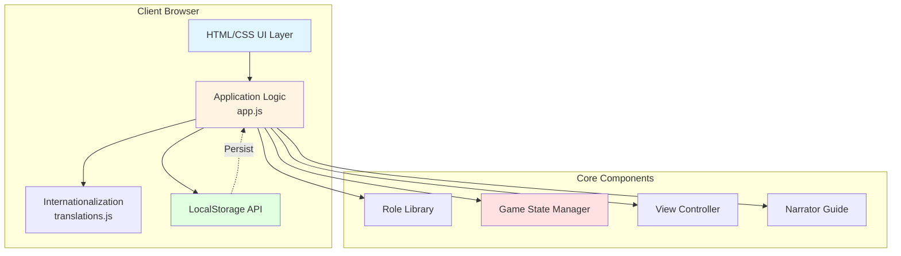
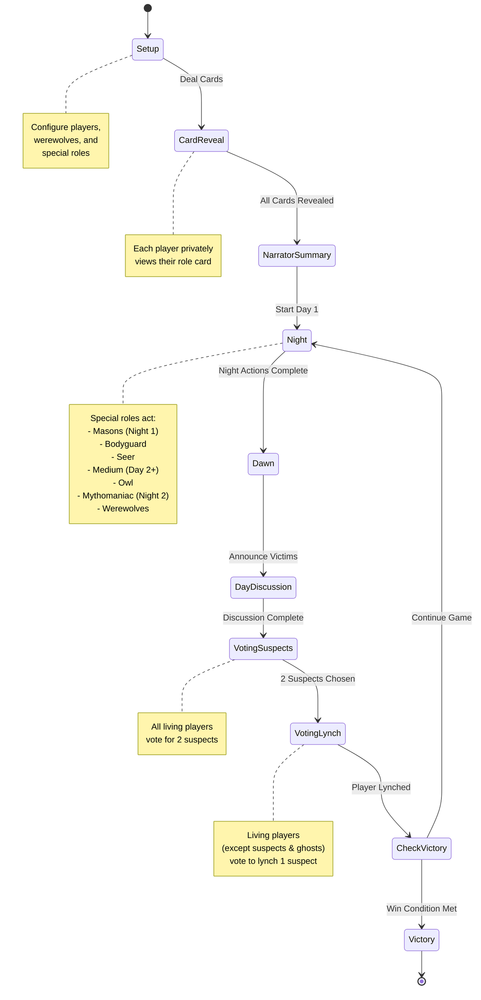
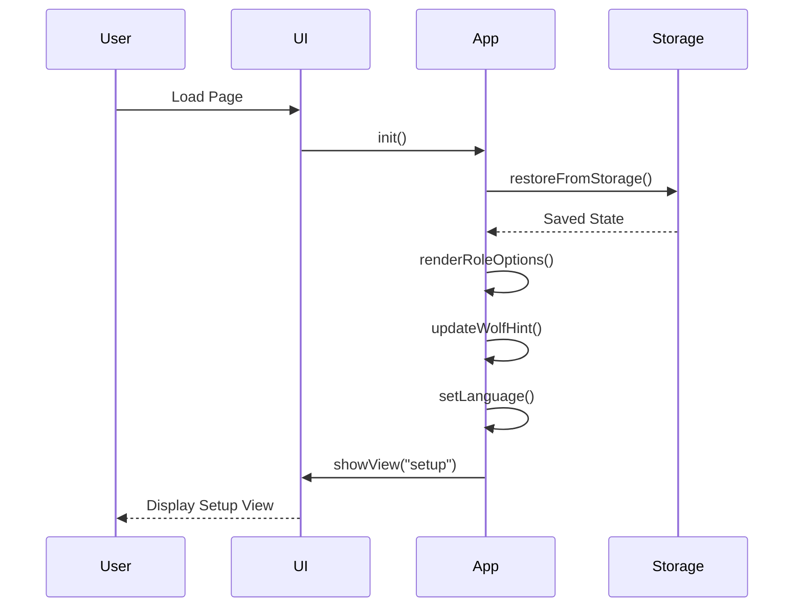
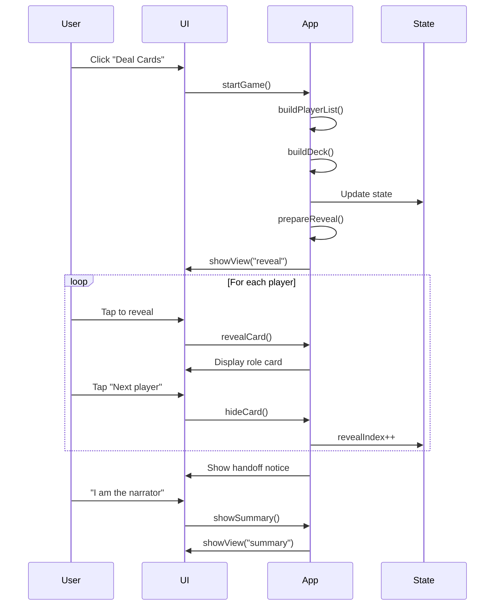
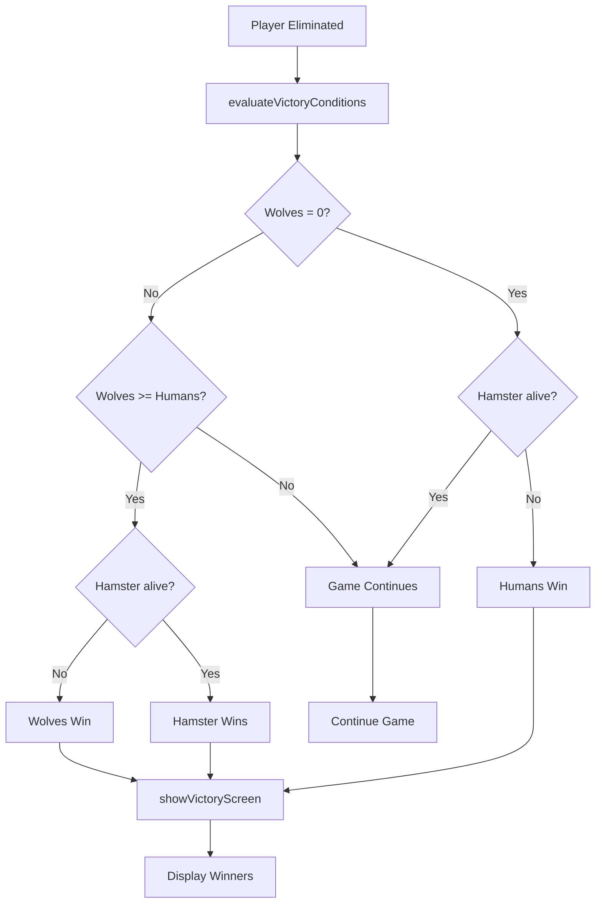

# Slay the Werewolf - Game Technical Document

## 1. Executive Summary

**Slay the Werewolf** is a browser-based digital companion for the social deduction game "Lupus in Tabula" (Werewolf/Mafia). The application is built as a single-page web application using vanilla JavaScript with no external dependencies, providing role distribution, game narration, and player tracking functionality.

**Technology Stack:**
- Pure HTML5, CSS3, and Vanilla JavaScript
- LocalStorage API for state persistence
- No frameworks or build tools required
- Supports 5-24 players with 3 language options (English, Spanish, Italian)

---

## 2. System Architecture

### 2.1 High-Level Architecture



### 2.2 File Structure

```
slaythewerewolf/
├── index.html              # Main HTML structure (311 lines)
├── css/
│   └── styles.css          # Application styling (versioned)
├── js/
│   ├── app.js              # Core game logic (2549 lines, 121 functions)
│   └── translations.js     # i18n strings (476 lines, 3 languages)
├── assets/
│   ├── logo.png
│   ├── favicon.ico
│   └── cards/              # AI-generated role card artwork
└── LICENSE                 # MIT License
```

---

## 3. Game State Management

### 3.1 State Object Structure

The application maintains a single global `state` object that persists to LocalStorage:

```javascript
const state = {
  // Game Setup
  deck: [],                    // Array of role cards
  players: [],                 // Array of player names
  customNames: [],             // User-defined player names
  
  // Game Progress
  revealIndex: 0,              // Current player viewing their card
  revealComplete: false,       // All cards have been revealed
  narratorDay: 1,              // Current day number
  maxDays: 1,                  // Maximum days (null if unlimited)
  
  // Player Status
  eliminatedPlayers: [],       // Array of {name, roleId, day, locked, type}
  playerVotes: {},             // Vote tracking {playerName: voteCount}
  benvenutoPlayer: null,       // Most recently lynched player
  
  // Special Roles
  activeSpecialIds: [],        // Active special role IDs
  mythStatus: null,            // Mythomaniac transformation status
  
  // UI State
  view: "setup",               // Current view: setup|reveal|summary|final
  playersCollapsed: false,     // Living players section collapsed
  rolesDetailsOpen: false,     // Special roles section expanded
  guideExpanded: true,         // Narration guide mode
  guideSteps: [],              // Current narration steps
  guideStepIndex: 0,           // Current step in guide
  
  // Game End
  victory: null,               // Victory state {team, winners}
  
  // Settings
  language: "en"               // Current language (en|es|it)
};
```

### 3.2 State Persistence

**Storage Key:** `SLAY_STATE`

**Persistence Strategy:**
- State is saved to LocalStorage after every significant action
- On page load, state is restored from LocalStorage
- Validation ensures corrupted state doesn't break the app

**Persisted Data:**
- Player configuration (count, names, roles)
- Game progress (current day, eliminations)
- UI preferences (language, collapsed sections)
- Complete game state for mid-game recovery

---

## 4. Role System

### 4.1 Role Library Structure

Each role is defined in the `ROLE_LIBRARY` constant with the following structure:

```javascript
{
  id: "roleId",
  name: "Role Name",
  team: "wolves" | "humans" | "loner",
  teamLabel: "Team Display Name",
  image: "assets/cards/image.jpg",
  description: "English description",
  locales: {
    es: { name, teamLabel, description },
    it: { name, teamLabel, description }
  }
}
```

### 4.2 Available Roles

| Role | Team | Min Players | Copies | Description |
|------|------|-------------|--------|-------------|
| **Werewolf** | Wolves | 5 | 1-3 | Hunts villagers each night |
| **Villager** | Humans | 5 | Variable | No special powers |
| **Seer** | Humans | 5 | 1 | Learns if a player is wolf/hamster or human each night |
| **Medium** | Humans | 9+ | 1 | Learns if previous lynch was a werewolf (from Day 2) |
| **Possessed** | Wolves | 10+ | 1 | Human who secretly wants wolves to win |
| **Bodyguard** | Humans | 11+ | 1 | Protects one player each night |
| **Owl** | Humans | 12+ | 1 | Marks a suspect; auto-nominated or killed (20+ players) |
| **Mason** | Humans | 13+ | 2 | Pair that recognizes each other on Night 1 |
| **Werehamster** | Loner | 15+ | 1 | Immune to wolves, dies if Seer observes them |
| **Mythomaniac** | Humans | 16+ | 1 | Copies a role on Night 2 (becomes wolf/seer/human) |

### 4.3 Role Configuration

```javascript
const OPTIONAL_CONFIG = [
  { roleId: "medium", copies: 1, minPlayers: 9 },
  { roleId: "possessed", copies: 1, minPlayers: 10 },
  { roleId: "bodyguard", copies: 1, minPlayers: 11 },
  { roleId: "owl", copies: 1, minPlayers: 12 },
  { roleId: "mason", copies: 2, minPlayers: 13, noteKey: "roles.masonNote" },
  { roleId: "werehamster", copies: 1, minPlayers: 15 },
  { roleId: "mythomaniac", copies: 1, minPlayers: 16 }
];
```

**Role Unlocking Logic:**
- Roles unlock based on player count
- Seer is always included
- Werewolf count is user-configurable (1-3)
- Remaining slots filled with Villagers

---

## 5. Game Flow

### 5.1 Game Phases



### 5.2 View States

The application has 4 main views controlled by `showView(viewName)`:

1. **Setup View** (`setupView`)
   - Player count configuration (5-24)
   - Werewolf count selection (1-3)
   - Optional player names
   - Special role selection
   - Role composition preview

2. **Reveal View** (`revealView`)
   - Sequential card revelation
   - Progress tracking (Player X / Total)
   - Privacy protection (tap to reveal)
   - Handoff notice to narrator

3. **Summary View** (`summaryView`)
   - Living players list with roles
   - Fallen players log
   - Day counter
   - Narration guide (step-by-step or full list)
   - Mythomaniac transformation panel
   - Elimination controls

4. **Final View** (`finalView`)
   - Victory announcement
   - Winners list with roles
   - New game button

---

## 6. Game Mechanics

### 6.1 Night Phase Sequence

The narration guide builds steps dynamically based on active roles and current day:

```javascript
function buildNarrationSteps(day) {
  const steps = [];
  
  // 1. Everyone closes eyes
  steps.push("Night {day}: everyone closes their eyes");
  
  // 2. Masons (Night 1 only)
  if (hasSpecial("mason") && day === 1) 
    steps.push("Call the Masons so they recognize each other");
  
  // 3. Bodyguard (Day 2+)
  if (hasSpecial("bodyguard") && day >= 2) 
    steps.push("Call the Bodyguard to choose someone to protect");
  
  // 4. Seer (always)
  steps.push("Call the Seer and reveal the vision");
  
  // 5. Medium (Day 2+)
  if (hasSpecial("medium") && day >= 2) 
    steps.push("Call the Medium and reveal whether the previous lynch was a wolf");
  
  // 6. Owl (if active)
  if (hasSpecial("owl")) 
    steps.push("Call the Owl to mark the nominated player");
  
  // 7. Mythomaniac (Night 2 only)
  if (isMythActive() && day === 2) 
    steps.push("Remind the Mythomaniac to pick a role to mimic");
  
  // 8. Werewolves (always)
  steps.push("Call the Werewolves to choose their victim");
  
  // 9. Werehamster reminder (if active)
  if (hasSpecial("werehamster")) 
    steps.push("Remember the Werehamster is immune to wolves");
  
  // 10. Dawn announcement
  steps.push("Dawn {day}: announce the victims of the night");
  
  // 11. Owl reveal (if active)
  if (hasSpecial("owl")) 
    steps.push("Reveal the Owl's chosen player before the discussion");
  
  // 12. Possessed reminder (if active)
  if (hasSpecial("possessed")) 
    steps.push("Keep in mind there may be a Possessed ally");
  
  // 13. Day discussion
  steps.push("Day {day}: let the village discuss and collect votes for lynching");
  
  return steps;
}
```

### 6.2 Voting System

**Suspect Selection:**
- All living players (including ghosts) vote
- Top 2 vote-getters become suspects ("indiziati")
- Ties broken by proximity to "Benvenuto" player (clockwise)
- Automatic tracking via `playerVotes` state

**Lynching:**
- Only living players vote (excluding suspects and ghosts)
- Suspect with most votes is eliminated
- Ties broken by proximity to "Benvenuto" player
- Lynched player becomes new "Benvenuto" player

**Vote Tracking:**
```javascript
state.playerVotes = {
  "PlayerName": voteCount,
  // ...
};

// Automatic indiziato calculation
function computeIndiziatoPlayers() {
  const sorted = Object.entries(state.playerVotes)
    .sort((a, b) => b[1] - a[1]);
  return sorted.slice(0, 2).map(([name]) => name);
}
```

### 6.3 Victory Conditions

Victory is evaluated after each elimination using `evaluateVictoryConditions()`:

```javascript
function computeVictoryOutcomeFromSet(eliminatedSet, isNightKill) {
  const living = players.filter(p => !eliminatedSet.has(p.name));
  const wolves = living.filter(p => p.card.team === "wolves");
  const humans = living.filter(p => p.card.team === "humans");
  const hamsters = living.filter(p => p.card.roleId === "werehamster");
  
  // 1. Humans win if no wolves remain
  if (wolves.length === 0 && !hamsters.length) {
    return { team: "humans", survivors: living };
  }
  
  // 2. Wolves win if they equal or outnumber humans
  if (wolves.length >= humans.length) {
    // Exception: Werehamster wins alone if present
    if (hamsters.length) {
      return { team: "loner", survivors: hamsters };
    }
    return { team: "wolves", survivors: living };
  }
  
  // 3. Werehamster wins if only survivor
  if (living.length === 1 && hamsters.length === 1) {
    return { team: "loner", survivors: hamsters };
  }
  
  return null; // Game continues
}
```

**Victory Teams:**
- **Humans** ("village"): All werewolves eliminated
- **Wolves** ("wolves"): Werewolves ≥ humans
- **Loner** ("loner"): Werehamster survives alone

---

## 7. Special Role Mechanics

### 7.1 Mythomaniac Transformation

The Mythomaniac is a unique role that transforms on Night 2:

```javascript
state.mythStatus = {
  playerName: "PlayerName",
  completed: false,
  targetName: null,
  resultType: null  // "wolf" | "seer" | "human"
};
```

**Transformation Rules:**
- **Target is Werewolf** → Mythomaniac becomes a Werewolf
- **Target is Seer** → Mythomaniac inherits Seer powers
- **Target is any other role** → Mythomaniac remains human

**UI Flow:**
1. Night 2: Narrator sees "Mythomaniac" panel
2. Select living player to copy
3. Confirm transformation
4. Mythomaniac's role updates in narrator view
5. Day progression blocked until transformation complete

### 7.2 Elimination Types

Players can be eliminated in two ways:

```javascript
{
  name: "PlayerName",
  roleId: "werewolf",
  day: 2,
  locked: true,        // Cannot be revived
  type: "sbranato"     // "sbranato" (mauled) or "lynched"
}
```

**Sbranato (Mauled):**
- Killed by werewolves at night
- Marked with 🐺 icon
- Cannot be applied to wolves or werehamster

**Lynched:**
- Voted out during day
- Marked with 🔥 icon
- Player becomes "Benvenuto" (tie-breaker reference)

**Locked Status:**
- Eliminations become "locked" when advancing to next day
- Locked players cannot be revived
- Prevents accidental changes to previous days

---

## 8. User Interface Components

### 8.1 Setup View Components

```
┌─────────────────────────────────────┐
│  ⚙️ Setup                           │
├─────────────────────────────────────┤
│  Number of players: [5-24]          │
│  Werewolves: [1-3]                  │
│                                     │
│  👥 Player names (optional)         │
│  [Input] [Add]                      │
│  • Player 1  [↑] [↓] [×]           │
│  • Player 2  [↑] [↓] [×]           │
│                                     │
│  ✨ Special roles ▼                 │
│  ☐ Medium (9+ players)              │
│  ☐ Possessed (10+ players)          │
│  ☐ Bodyguard (11+ players)          │
│  ...                                │
│                                     │
│  Role composition:                  │
│  2× Werewolf, 1× Seer, 5× Villager │
│                                     │
│             [🎴 Deal the cards]     │
└─────────────────────────────────────┘
```

### 8.2 Narrator Summary Components

```
┌─────────────────────────────────────┐
│  📋 Narrator summary                │
├─────────────────────────────────────┤
│  👥 Living players (6) [⊞]          │
│  ├─ Alice - Seer [🐺] [🔥]         │
│  ├─ Bob - Werewolf [🐺] [🔥]       │
│  └─ ...                             │
│                                     │
│  🪦 Fallen players (2) ▼            │
│  ├─ Charlie - Day 1 - Villager     │
│  └─ ...                             │
│                                     │
│  Current day: 2                     │
│  [Next day]                         │
│                                     │
│  Narration guide                    │
│  Step 3 / 13                        │
│  "Call the Seer and reveal..."      │
│  [⬅️ Back] [Next ➡️]                │
└─────────────────────────────────────┘
```

### 8.3 UI/UX Enhancements

**Mobile-First Features:**
- Ripple effects on button clicks
- Haptic feedback (8ms vibration)
- Touch-friendly drag-and-drop for player reordering
- Responsive layout (desktop, tablet, mobile)

**Accessibility:**
- ARIA labels and roles
- Semantic HTML5 elements
- Keyboard navigation support
- Screen reader friendly

**Visual Feedback:**
- Toast notifications for errors
- Shake animation on invalid input
- Smooth transitions between views
- Progress indicators

---

## 9. Internationalization (i18n)

### 9.1 Translation System

**Supported Languages:**
- English (en) - Default
- Spanish (es)
- Italian (it)

**Translation Function:**
```javascript
function t(key, vars) {
  const langPack = TRANSLATIONS[state.language] || TRANSLATIONS["en"];
  const template = langPack[key] ?? TRANSLATIONS["en"][key] ?? key;
  return vars ? formatString(template, vars) : template;
}

// Usage
t("victory.wolves.title")  // "The Werewolves conquer Tabula"
t("status.player", { current: 3, total: 8 })  // "Player 3 / 8"
```

**Translation Coverage:**
- All UI labels and buttons
- Role names and descriptions
- Game messages and confirmations
- Narration guide steps
- Victory messages
- Error messages

**Dynamic Content:**
- Variable interpolation using `{varName}` syntax
- Pluralization handled manually
- Fallback to English if translation missing

---

## 10. Data Flow Diagrams

### 10.1 Game Initialization Flow



### 10.2 Card Dealing Flow



### 10.3 Victory Check Flow



---

## 11. Key Functions Reference

### 11.1 State Management

| Function | Purpose |
|----------|---------|
| `init()` | Initialize app, restore state, render UI |
| `persistState()` | Save state to LocalStorage |
| `restoreFromStorage()` | Load state from LocalStorage |
| `resetGame()` | Clear game state, return to setup |

### 11.2 Game Flow

| Function | Purpose |
|----------|---------|
| `startGame()` | Build deck, assign roles, start reveal |
| `prepareReveal()` | Initialize card revelation sequence |
| `revealCard()` | Show current player's role |
| `showSummary()` | Enter narrator view |
| `advanceDay()` | Progress to next day/night cycle |

### 11.3 Player Management

| Function | Purpose |
|----------|---------|
| `buildPlayerList()` | Generate player names (custom or default) |
| `renderPlayerList()` | Display player chips with drag/drop |
| `toggleElimination()` | Mark player as eliminated/revived |
| `lynchPlayer()` | Execute lynching with confirmation |
| `isEliminated()` | Check if player is eliminated |

### 11.4 Victory System

| Function | Purpose |
|----------|---------|
| `evaluateVictoryConditions()` | Check for win conditions |
| `computeVictoryOutcomeFromSet()` | Calculate victory from player set |
| `predictVictoryOnElimination()` | Preview victory before confirming |
| `showVictoryScreen()` | Display victory UI |

### 11.5 UI Rendering

| Function | Purpose |
|----------|---------|
| `showView()` | Switch between main views |
| `renderSummaryList()` | Render living players with controls |
| `renderFallenList()` | Display eliminated players log |
| `renderGuide()` | Show narration guide steps |
| `renderMythPanel()` | Display Mythomaniac transformation UI |

---

## 12. Technical Constraints & Design Decisions

### 12.1 No Dependencies Philosophy

**Rationale:**
- Zero installation required
- Works offline after initial load
- No build process needed
- Minimal attack surface
- Fast load times

**Trade-offs:**
- Manual DOM manipulation
- Custom state management
- No reactive framework benefits
- More verbose code

### 12.2 LocalStorage Limitations

**Constraints:**
- 5-10MB storage limit (browser-dependent)
- Synchronous API (blocking)
- String-only storage (JSON serialization required)

**Mitigations:**
- Efficient state structure
- Graceful degradation if storage fails
- Error handling for corrupted data

### 12.3 Mobile Considerations

**Optimizations:**
- Touch event handlers for drag/drop
- Haptic feedback on interactions
- Viewport meta tag prevents zoom
- Large touch targets (44px minimum)
- Smooth scrolling disabled during reveal

---

## 13. Security & Privacy

### 13.1 Privacy Features

- **Zero Tracking**: No analytics, cookies, or external requests
- **Local-Only**: All data stays in browser LocalStorage
- **No Server**: Completely client-side application
- **Offline Capable**: Works without internet after initial load

### 13.2 Data Handling

**Stored Data:**
- Player names (user-provided)
- Game configuration
- Current game state
- UI preferences

**Not Stored:**
- No personal information
- No gameplay analytics
- No user accounts
- No external data transmission

---

## 14. Future Enhancement Opportunities

### 14.1 Potential Features

1. **Additional Roles**
   - Cupid (links two players)
   - Hunter (shoots on death)
   - Little Girl (peeks during night)

2. **Game Variants**
   - Custom role creation
   - Alternative victory conditions
   - Time-limited phases

3. **Enhanced Narrator Tools**
   - Timer for discussions
   - Vote tallying automation
   - Game history export

4. **Multiplayer Sync**
   - WebRTC peer-to-peer
   - QR code device linking
   - Synchronized state across devices

### 14.2 Technical Improvements

1. **Progressive Web App (PWA)**
   - Service worker for offline
   - App manifest for install
   - Push notifications

2. **Accessibility Enhancements**
   - High contrast mode
   - Font size controls
   - Voice narration

3. **Performance Optimizations**
   - Virtual scrolling for large player lists
   - Lazy loading for card images
   - Code splitting

---

## 15. Conclusion

Slay the Werewolf demonstrates a well-architected single-page application that prioritizes:

- **Simplicity**: No dependencies, pure vanilla JavaScript
- **Privacy**: Zero tracking, local-only storage
- **Usability**: Intuitive UI, mobile-friendly, multi-language
- **Maintainability**: Clear separation of concerns, comprehensive state management
- **Extensibility**: Modular role system, flexible game flow

The application successfully digitizes the Lupus in Tabula experience while maintaining the social and interactive nature of the original card game.

---

**Document Version:** 1.0  
**Last Updated:** 2025-11-26  
**Project Repository:** [github.com/n0tsosmart/slaythewerewolf](https://github.com/n0tsosmart/slaythewerewolf)
